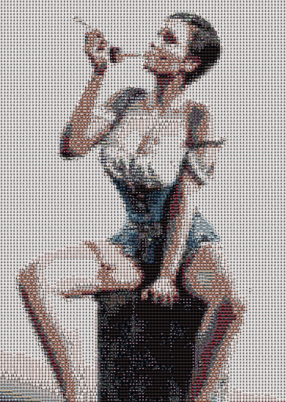

# go-mosaic
go-mosaic is a tool for making photo mosaics. Photo mosaics, or montage photos, montage collages, are an art technique of image processing. Pictures made in this way are composed of many small photos when viewed close, but when viewed from a distance, each photo Through the fine-tuning of light and shadow and color, the basic pixels of a large picture are called the photo mosaic technique

# Features
* Designed for massive pictures, can support tens of thousands of pictures
* Built-in cache database, pictures are deleted and changed automatically from cache
* Multi-core construction, loading, calculation and replacement are all concurrent

# Use
* Clone the project, compile, or download [release](https://github.com/esrrhs/go-mosaic/releases)
* Execute commands and wait for completion
```
go-mosaic.exe -src input.png -target output.jpg -lib ./test
```
* Among them, ./test is the picture folder, which is used to form the elements of the final picture. input.png is the target image, which is used to generate the final large image output.jpg. The more material pictures, the more accurate the generation
* For more parameters, refer to help
```
Usage of D:\project\go-mosaic\test.exe:
  -checkhash
    	check database pic hash (default true)
  -database string
    	cache datbase (default "./database.bin")
  -lib string
    	image lib path
  -libname string
    	image lib name in database (default "default")
  -maxsize int
    	pic max size in GB (default 4)
  -pixelsize int
    	pic scale size per one pixel (default 64)
  -scalealg string
    	pic scale function NearestNeighbor/ApproxBiLinear/BiLinear/CatmullRom (default "CatmullRom")
  -src string
    	src image path
  -srcsize int
    	src image auto scale pixel size (default 128)
  -target string
    	target image path
  -worker int
    	worker thread num (default 12)
```

# Example




