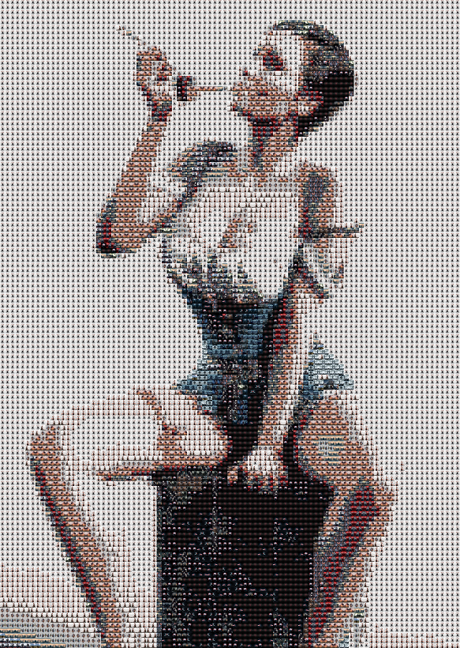

# go-mosaic

[](https://github.com/esrrhs/go-mosaic)
[](https://github.com/esrrhs/go-mosaic)
[](https://goreportcard.com/report/github.com/esrrhs/go-mosaic)
[](https://github.com/esrrhs/go-mosaic/releases)
[](https://github.com/esrrhs/go-mosaic/releases)
[](https://hub.docker.com/repository/docker/esrrhs/go-mosaic)
[](https://github.com/esrrhs/go-mosaic/actions)
[](https://golang.org)

go-mosaic is a tool for making photo mosaics (montage collages). Photo mosaics are an art technique where pictures are composed of many small micro-photos when viewed close up, but resemble a unified larger image when viewed from a distance.

[中文文档](./README.md)

## Features

* **High Performance Concurrency**: Concurrent multi-worker design for loading, resizing, and pixel mapping across multi-core CPUs.
* **Modern Embedded Database**: Powered by `bbolt` embedded key-value storage with caching, change detection, and hash validation.
* **Modern Go Tooling**: Written for Go 1.22+, completely race-condition free (verified with `go test -race`), with unit and integration test coverage.
* **Multi-Platform Support**: Ready for Linux, macOS (including Apple Silicon M-series), Windows, and FreeBSD, along with a minimal multi-stage Docker image.

## Quick Start

### 1. Build or Download

* Download the pre-built binary for your platform from [GitHub Releases](https://github.com/esrrhs/go-mosaic/releases).
* Or compile locally using Go:
  ```bash
  git clone https://github.com/esrrhs/go-mosaic.git
  cd go-mosaic
  make build
  ```

### 2. Generate Mosaic

```bash
./go-mosaic -src input.png -target output.jpg -lib ./test
```

* `-src`: Source image to recreate as a mosaic.
* `-target`: Target output mosaic image path (supports `.png`, `.jpg`, `.jpeg`).
* `-lib`: Folder containing library images that form individual mosaic tiles.

### 3. Docker Usage

```bash
# Build Docker image
docker build -t go-mosaic:latest .

# Run mosaic generator inside container
docker run --rm -v $(pwd):/workspace go-mosaic:latest \
  -src /workspace/input.png \
  -target /workspace/output.png \
  -lib /workspace/test
```

## Options

```text
Usage of go-mosaic:
  -checkhash
    	check database pic hash (default true)
  -database string
    	cache database (default "./database.bin")
  -lib string
    	image lib path
  -libname string
    	image lib name in database (default "default")
  -maxsize int
    	pic max size in GB (default 4)
  -pixelsize int
    	pic scale size per one pixel (default 64)
  -scalealg string
    	pic scale function NearestNeighbor/ApproxBiLinear/BiLinear/CatmullRom (default "CatmullRom")
  -src string
    	src image path
  -srcsize int
    	src image auto scale pixel size (default 128)
  -target string
    	target image path
  -worker int
    	worker thread num (default 12)
```

## Development

```bash
# Run tests with race detection
make test

# Code static analysis
make vet

# Cross-compile release binaries for all platforms
make pack

# Clean build artifacts
make clean
```

## Example

| Original Target Image | Generated Mosaic Collage |
| :---: | :---: |
|  |  |
